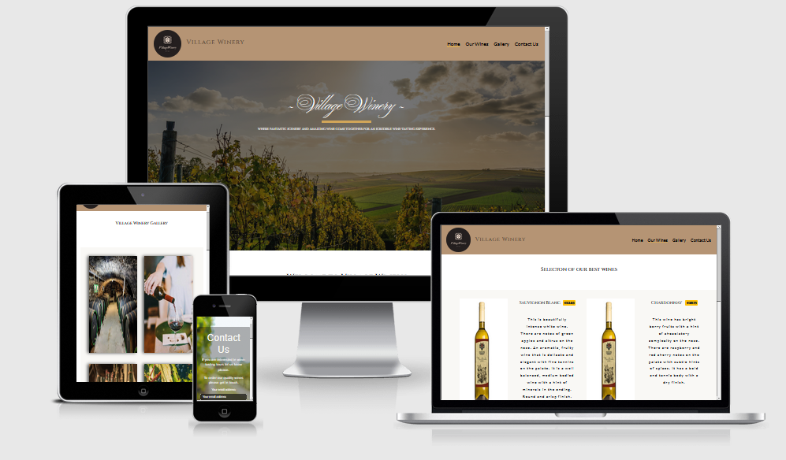
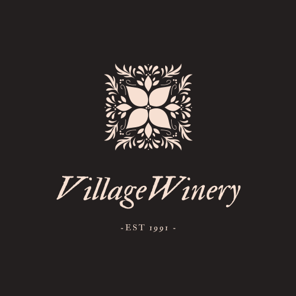
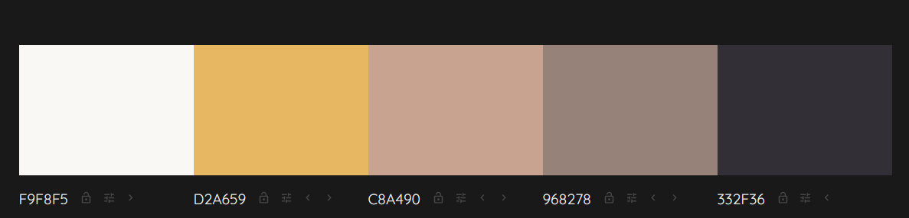

# Village Winery 

 

***

 
 

* Link to live website : [Village Winery](https://kuzgo.github.io/village-winery/index.html)
***

A family owned business producing quality wines and organizing wine tasting tours. 
Due to remote location it occasionally might be difficult to discover this little hidden gem.
I decided to create a web site which will not only provide an online presence,
but will also help potential clients find the location easier. 
Ability to browse products and services offered which is aimed towards increasing the amount of visits
,bottles of vines sold and the owner's revenue. 
Previous customer’s experiences will be available 
and lastly contacting the owner for any queries using the form provided. 
## UX

### User Stories

* User 1 : As a wine lover I want to find a place where I can taste quality wine.
* User 2 : As a user I want to be able to contact the owner and book a tour.
* User 3 : As a wine collectionner I want to be able to order a bottle of wine from different parts of the world.
* User 4 : As a user I want to navigate the site easily to find products and services.
* User 5 : As a business owner I want to easily contact potential wine suppliers.

This website is aimed towards those who are wine collectionners, connoisseurs, bars or restaurant owners looking for a quality wine supplier 
or just people who want to enjoy a good glass of wine in a calming environment.

Website's design is responsive and mobile devices first friendly. Design is minimalistic and elegant with all features included to 
create a positive user experience.

## Existing features

* Navbar
    * Navbar is visible on every page of the website and consists of the company logo, company title and four `navlink` options for users to navigate to the desired section of the webpage.
* Home 
    * Home is a part of the navigation bar, it is used to bring the user to the landing/home page.
* Our Wines
    * Consists photographs of the products with description, price and ability to order the product online. Order online is currently linked to contact form and is to be further developed.
* Gallery
    * Gallery contains various images of vineyards, grapes, bottles of wine and cellars. Images will slightly increase in size once hovered over.
* Contact Us
    * The Contact Us page is designed with the hero image in the background and contact form in the middle of the screen. Form background is see-through with a small percentage of opacity.
      Form contains three fields. The first will require the user's name, the second email address and the third would be where users can contact the owner with any queries.
      Form cannot be submitted if Name and Email address are not entered.
* Hero image
    * Landing page and contact page are designed with hero image in the background
* Map of the location
    * As the website has been designed and developed using HTML and CSS mainly,I was looking for a way to add Google maps to my project using these programming languages.
      After researching Google,I came across a simple solution by copying embedded HTML code snippet as follows: Open Google maps in browser -> place a pin to location -> click share button -> select option "Embed a map" -> copy HTML link. 
      I wanted the width to be always 100% of the screen size, however it would not pass [W3C](https://validator.w3.org/) as an inline CSS so I decided to specify this in style.css file.
* Footer with links to social media
    * Footer is a feature visible on every page. It is designed with a minimalistic approach containing social media links to connect with the business owner. 
      Links will open the desired social media platform in a separate tab so the users can still remain on the page they are currently on.
      Once hovered over the social media links it will wrap the icon with the same color scheme as other clickable links to follow the consistency throughout the entire website. 
* Color scheme

    * Color palette for the website has been generated using [Colormind](http://colormind.io).
    Carefully selected color scheme with the idea in mind to create harmonious and  aesthetically pleasing website where users would want to remain longer.

 

* Typography
    * The website fonts used are Google fonts Cinzel for headers and Lato for the text paragraphs and also Lato for contact form. Google font's Ballet font was used only for creation of
    a Village Winery header on a landing page.

### Features Left to Implement
* Feature which will still need to be implemented is ability to make an online payment. 
  This is planned to be implemented at a later stage of the course completion when I gain knowledge of how to achieve that.
* Linking contact form to corporate email address. This will be implemented in case this website is used for existing business 
  as currently it is only designed and developed for educational purposes.  
* Option to read the website content in various different languages such as Spanish, Italian, German which will increase potential clients and 
  make the website more accessible to non-English speaking regions.
* Ability to submit a client's review after visiting a winery or tasting the wine.

## Technologies Used 

* __HTML/HTML5__ used for a basic structure of the page and content.
* __CSS/CSS3__ used to add style to the page and its content.

### Frameworks,Libraries and other programs :
***

* [__Bootstrap 4.1.3__](https://getbootstrap.com) as a framework.
* [__Balsamiq__](https://balsamiq.com) used for creating a wireframe.
* [__Online Convert__](https://image.online-convert.com) used to convert photos to webp format.
* [__Google Fonts__](https://fonts.google.com) used for project fonts.
* [__Gitpod__](https://gitpod.io) used as a development environment.
* [__Canva__](https://www.canva.com) used for logo creating.
* [__Fontawesome__](https://fontawesome.com) used for adding icons.
* [__Colormind__](http://colormind.io) used for color palette selection.
* Mozilla DevTools used for debugging and testing.
* Google DevTools used for debugging and testing.
* [__Youtube__](https://www.youtube.com/) used as a general source of information.
* [__W3Scool__](https://www.w3schools.com/) used as a general source of information.
* [__Pexel__](https://www.pexels.com/) used to download the majority of the website's images.
* [__Stackoverflow__](https://stackoverflow.com/) used as a general source of information.
* [__W3C Markup Validator__](https://validator.w3.org/) Used to test HTML code validation.
* [__W3C CSS Validatior - Jigsaw__](https://jigsaw.w3.org/css-validator/) Used to test CSS code validation.
* [__Am I Responsive__](http://ami.responsivedesign.is/) used during post deployment testing stage.
* [__Pixlr__](https://pixlr.com) used to remove background and editing photographs.

### Project Wireframe Link :
***
To see Project Wireframes please click the link: <a href="https://github.com/kuzGo/village-winery/tree/master/assets/wireframe">Wireframes</a> 

## Testing :

 Click the link to see testing of the website please in a separate file:

<a href="https://github.com/kuzGo/village-winery/blob/master/TESTING.md">TESTING.md</a>

## Deployment

The project's website code was written using Gitpod IDE and had to be pushed to GitHub enering `git push` command in CLI.
As the branch used for making changes to the code was not a master branch,I was creating a new pull request to squash and merge the branch to a master branch.

Deployment of the website on GitHub can be completed following the next steps:

1. Create a GitHub account and remain logged in.
2. Repository stored on GitHub is named __kuzGo/village-winery__
3. Once the repository is selected in the top right corner are a few options, navigate to an option __Settings__ .
4. In __Settings__ scroll down to the GitHub Pages section.
5. Click drop down __"None"__ button and select __master__ branch.
6. Click __"Save"__.

How to clone a repository:

To clone a repository and work locally on it follow the next steps :

1. Navigate to __kuzGo/village-winery__ repository on GitHub.
2. On the repository main page locate __"Code"__ drop down button and click on it.
3. Ensure to select __HTTPS__ and click on the clipboard icon to copy the URL.
4. In the IDE you chose to work, open the new terminal 
5. Change the current working directory to the location where you want the cloned directory.
6. Enter command `git clone` and paste afterwards the URL you copied earlier.
7. Click Enter.

### Credits :
***

#### Photographers:

* [Pexel](https://www.pexels.com/) images downloaded from the following photographers:

> * Elle Hughes
> * David
> * Hunt on photos studio
> * Bruno Cantuária
> * Balázs Burján
> * Julia Volk
> * Ion Ceban
> * Leo Woessner
> * Markus Spiske
> * Ksenia Chernaya
> * David Taljat
> * Rodnae Productions

* Photographs downloaded from [Unsplash](https://unsplash.com) from the following photographers :

> * Maja Petric
> * Rodrigo Abreu
> * Cayton Heath
 

#### Code snippets used from external sources:
* Bootstrap 
    *  Bootstrap documentation used as a reference for navbar code which was hugely refactored and adjusted to suit 
     my project's requirements.
* Google maps

    * Embedded `iframe` html code copied from Google maps and added to the existing html code. It has been adjusted to fit the project's needs.

* Nishant Kumar, my mentor,suggested that I create `root:` and use variables to easily adjust/change colours in CSS. 

#### Content
* The text used to describe different types of wine used for the project has been copied from  [Dublin Fine Wines](dublinfinewines.ie)

## Acknowledgements
***
* I would like to thank my mentor Nishant Kumar for all the support and pieces of advice during  mentoring sessions and sharing his knowledge with me.
* Great support and motivation came from the CI Slack community and Code Institute tutors.
* Thanks to the Code Institute for all inspirations and ideas whilst learning and working on the previous different projects Love Running, Whiskey Drop,Resume. 