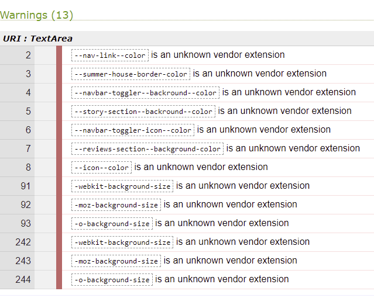

## Testing &  debugging:

Pre-deployment testing:

At the early stage of my project for testing the website I used Mozilla and Google Chrome DevTools to test responsiveness, accessibility and any potential bugs on different
device models and screen sizes.
The issues I encountered during different stages of my project are:
1. Navbar text color contrast issue. While I personally liked more color used for text, to increase accessibility I decided to change color to #040101,
which has contrast ratio 7.38, AA 4.5 ,AAA 7.0 making the website more accessible for diverse needs of users.

2. Contact form would not display correctly in the landscape mode. As I had contact form wrapped with a `jumbotron`, which had a background image specified to cover 100vh.
This pushed the contact form to the bottom making some parts of form invisible/covered by the footer. Removing 100vh fixed the issue.

3. Order online buttons were not correctly positioned. After adding different paragraphs of text to wines.html section, it moved all buttons underneath the text to
 different levels of the screen. To fix this issue I had to use position: absolute in CSS which displayed buttons as expected on large and medium screens but created an issue with small sizes 
 screens. Additional fix was to add some bottom margin to paragraphs which provided some breathing space between buttons and text.
4. In the `navbar`, the company title next to the company logo would not render properly with small screen sizes. As this would push navbar links to the right,
   cutting off some of the links. I decided to hide the company title for small devices. At later stage of testing I noticed that this would not work in the landscape mode on some small 
   size screens (Moto 4G) and refactored the code to hide title with small screen sizes and display as a block using Bootstrap's code .d-none .d-md-inline .d-xs-none,
   this resolved the issue.
5. One of the first Lighthouse reports was showing lower performance, best practices and SEO. Based on that report I refactored the code to add `meta` keywords and description to increase 
   SEO and also `aria-*` attributes to make better user experience for users of screen readers and other assistive technologies.
6. I conducted numerous tests of both HTML and  CSS code using [The W3C CSS Validation Service - Jigsaw](https://jigsaw.w3.org/css-validator/) and [The W3C Markup Validation Service validator](https://validator.w3.org/)
   during various different stages of my project to ensure that codes are valid. Most of the times my reports were with a few minor errors and warnings which could have been easily fixed.

    

   The warnings displayed are due to Jigsaw's inability to validate/recognise certain CSS methods.

    
 

    
 

    
    
Post-deployment testing:

1. One of the first issues encountered during testing of the deployed website was that images in the gallery and contact form hero image would not display at all.
 Using Mozilla and Google DevTools I found that the error was in the absolute file path. 
 After changing file paths to relative instead of absolute all images in question were rendered as expected. 

2. The entire image gallery would display photographs slightly moved to the right side of the screen.This issue was resolved by adding margin shorthand to the .gallery-image class.

3. The website has been tested for responsiveness using [Am I Responsive](http://ami.responsivedesign.is/).
 
4. One of the post-deployment issues brought to my attention was that once hovered over the navigation bar and buttons it would push the other content due to the border appearing around links and buttons. 
 To fix this I researched Google and came across a solution on [Stackoverflow](https://stackoverflow.com/questions/18887058/css-hover-creating-border-but-pushing-content).
5. Lighthouse reports ran for both mobile and desktops:

Lighthouse mobile devices report:

 

Lighthouse desktop devices report:

 

6. Deployed website has been tested across many different devices where a few errors have been found and corrected. 

    * Our Wines page misalignment has been fixed by making images more responsive and correcting `margin` and `padding`.
    * Home page's hero image did not have any information for users once they landed on the home page. To increase UX I have added an inviting company title with a small paragraph of text 
        explaining to potential clients what is the business of the website owner.
    * Contact form did not have an address and contact details such as email address and phone number.This has been added along with the location map.
    * Contact form button contrast corrected by changing the button color.

## User stories testing:

 * User 1 : As a wine lover I want to find a place where I can taste quality wine.
    * While browsing the internet in search of places producing quality wines I found Village Winery.
    I was able to see their products, previous customers reviews and photographs of the winery.
    I decided to contact the owner and book a wine-tasting tour.

* User 2 : As a user I want to be able to contact the owner and book a tour.
    * I was able to easily navigate through the website and find contact details.
    As the location of the winery was interesting to me I contacted the owner using the contact form provided on the website to book a tour.

* User 3 : As a wine collectionner I want to be able to order a bottle of wine from different parts of the world.
    * I was able to review the products and their descriptions. 
    In my collection I missed a bottle of wine from the country of Village Winery's origin so I decided to order a bottle of wine online using the option provided on their website.

* User 4 : As a user I want to navigate the site easily to find products and services.
    * I was able to navigate through the entire website easily and use the navigation bar to bring me to the different website pages.
     Every time I wanted to go back to the home page I could click the company logo which will bring me back there. 
     I checked the company's social media platforms to get a better understanding of their business.

* User 5 : As a business owner I want to easily contact potential wine suppliers.
    * As a business owner I own a restaurant and was in search of the best quality wine suppliers. I reviewed the Village Winery website and their wine, their tradition and the way they produce quality wines.
     I have decided to contact the owner for further cooperation. I followed them on their social media sites to keep track of any updates.

## Functionality testing

As part of functionality testing the developer tested every part of the website to ensure that everything is working properly on different types of devices and screen sizes: 
### Navigation bar:
1. Once hovered over navigation bar links,the border will appear and the text will change color around the Home, Our Wines, Gallery and Contact Us links.
2. When the page is selected it would be clearly indicated to the user by underlining the currently visited page. 
3. Once clicked on the company logo regardless of the current user's location on the website it would bring the user back to the home page.
### Google Map:
1. Location of the winery is shown to the users and will always display the full width of the screen. 
2. If the user would need to view the larger map it will be open in a separate tab.
### Social media links:
1. Hovering over social media links would change the color of the icons. 
2. Clicking on the social media icon will open the social media page in a separate browser tab.
### Our Wines:
1. The images of the products are displayed without any background to create a blending effect. 
2. The price of each product is highlighted with a different colour. Order online buttons have a shopping basket icon added to indicate product purchase. 
3. Hover over the buttons would change the buttons background colour and will add border to follow consistency of the website.
### Gallery:
1. All images are displayed in various sizes with a shadow behind each image .
2. Along with the hover effect when the image is slightly zoomed in, the idea was to create the floating image effect.   
### Contact us :
1. Send button hover effect will change the background colour and will add border to follow consistency of the website.
2. Clicking the Send button  without adding the user's __Email__ address will display a warning sign advising users it is required to fill before hitting the button. 
3. Clicking the Send button  without adding the user's __Name__ will display a warning sign advising users it is required to fill before hitting the button. 
4. Email and telephone icons would not be visible on small screen devices such as mobile phones.
5. Google map would work as per previous test.